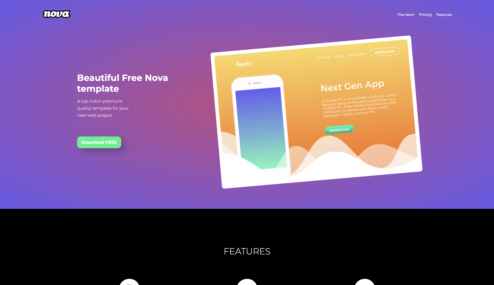

#  HTML and CSS basics: project based on design from [Webscope](https://webscopeapp.com/)

## :technologist: Technologies and metodologies

HTML & CSS & Flexbox & BEM & Mobile first

### Screenshot

### Links
- Solution URL: [See my code](https://github.com/lukas-szarkowski/webscope-landing-page)
- Check live version of this project: **[LIVE](https://lukas-szarkowski.github.io/webscope-landing-page/)**

## Author
- Github - [lukas-szarkowski](https://github.com/lukas-szarkowski)

## Thanks :handshake:
Thanks to my [Mentor - devmentor.pl](https://www.devmentor.pl) - for providing me with this task and for code review.
